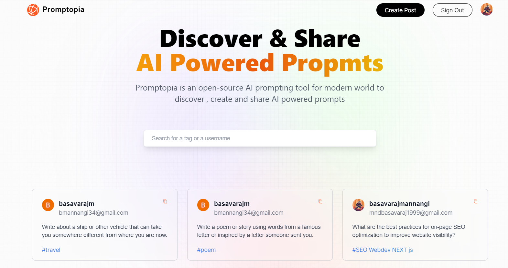

## NEXT Js
## Full Stack Project - Promptopia
### The new features I learnt in this project

- App Folder Structure
- Client Components vs Server Components
- File-based Routing (including dynamic and nested routes)
- The Pages Router has a file-system based router built on the concept of pages.
- Serverless Route Handlers (Next API)
- Metadata and Search Engine Optimization (SEO)
- Three ways to fetch data in Next.js:
    - Server Side Rendering (SSR),
    - Static Site Generation (SSG)
    - Incremental Static Generation (ISR)

### About Promptomia Project : 
---

 - We can login using Nextauth and Google Authentication.
 - NextAuth is a complete open source authentication solution.
    - https://github.com/nextauthjs/next-auth-example
 - Google authentication credentials to verify the account.
 - profile view( own accound & others account profile), and can see the prompts created by the perticular users by checking their profile.
 - CRUD functionalities for handling _Prompts_ which added by the users.
 - Users can edit/delete only the prompts which is created by them.

 

